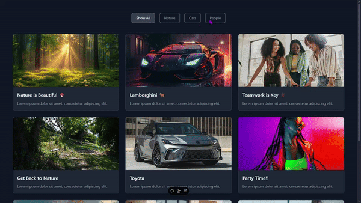

---

# 🌟 Simple Photo WebApplication 🌟  

## Introduction  
The **Simple Photo WebApplication** is a React-based app that allows users to filter photos by categories like nature, cars, and people. It demonstrates the use of reusable components, responsive design, and state management in a practical and visually appealing way.  

## 🛠️ Tech Stack  
- **⚛️ React**: For building the user interface.  
- **📜 TypeScript**: For type-safe development.  
- **⚡ Vite**: As the development environment.  
- **🎨 Tailwind CSS**: For styling and layout.  

## ✨ Features  
- **🔍 Dynamic Filtering**: Filter images by categories such as `nature`, `cars`, `people`, or view them all.  
- **♻️ Reusable Components**: Modular components for buttons, images, and text.  
- **📱 Responsive Design**: Optimized for various screen sizes.  
- **🎨 Custom Styling**: Enhanced UI with Tailwind CSS.  

## 🛤️ Process  
1. 🗂️ Designed a dataset (`FilterData.ts`) containing categorized image information.  
2. 🧩 Built reusable components for text (`Text`), images (`Image`), and buttons (`Button`).  
3. ⚙️ Created the `ImageFilter` component to manage state and render filtered results.  
4. ✍️ Styled the app using Tailwind CSS to ensure responsiveness and clean visuals.  
5. 🤝 Integrated the components into a cohesive, functional UI.  

## 🌱 What I’ve Learned  
- 📚 How to create and manage reusable components in React.  
- ⚙️ Effective state management for dynamic filtering.  
- ✅ Improved understanding of TypeScript for type safety.  
- 🎨 Using Tailwind CSS for building modern, responsive UIs.  

## 🚀 Improvements  
- 🌀 Add animations for smoother image transitions.  
- 🔍 Implement a search feature for better navigation.  
- ♿ Include accessibility improvements like keyboard navigation and ARIA labels.  
- 🖼️ Add support for user-uploaded images.  

## 💻 Running the Project  
1. **Clone the repository**:  
   ```bash  
   git clone https://github.com/Lawani-EJ/Simple-Photo-WebApplication.git  
   ```  
2. **Navigate to the project directory**:  
   ```bash  
   cd Simple-Photo-WebApplication  
   ```  
3. **Install dependencies**:  
   ```bash  
   npm install  
   ```  
4. **Start the development server**:  
   ```bash  
   npm run dev  
   ```  
5. **Open the application** in your browser at `http://localhost:5173`.  

## 🎥 Video and 📸 Screenshot  
- **🎥 Video Demo**:  
    
- **📸 Screenshot**:
- 


## 🙏 Thank You  
Thank you so much for checking out this project! 💖 If you found it helpful, please consider giving it a ⭐ on GitHub. Your support means the world! Feel free to reach out with feedback, suggestions, or ideas. 🚀  

---  
